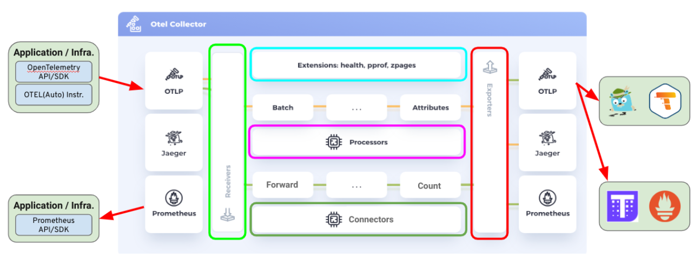
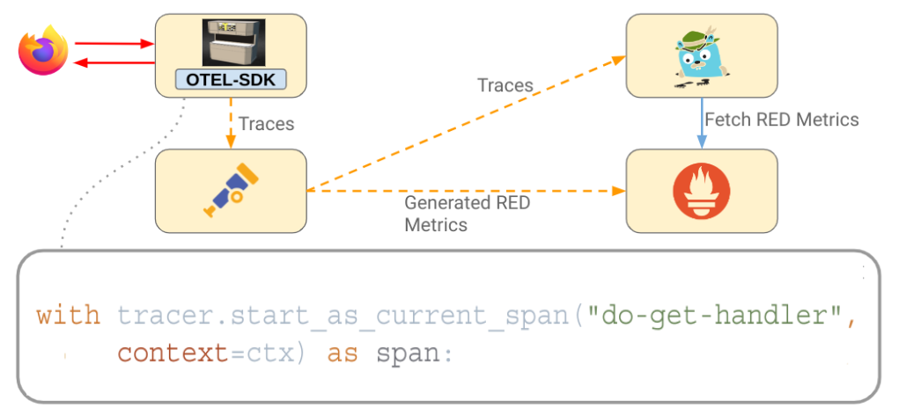
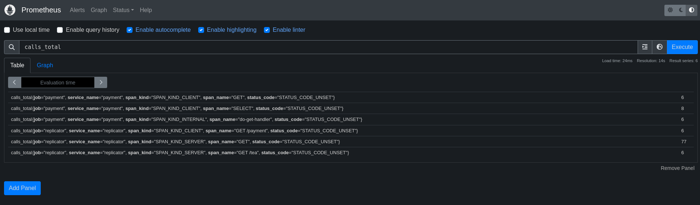
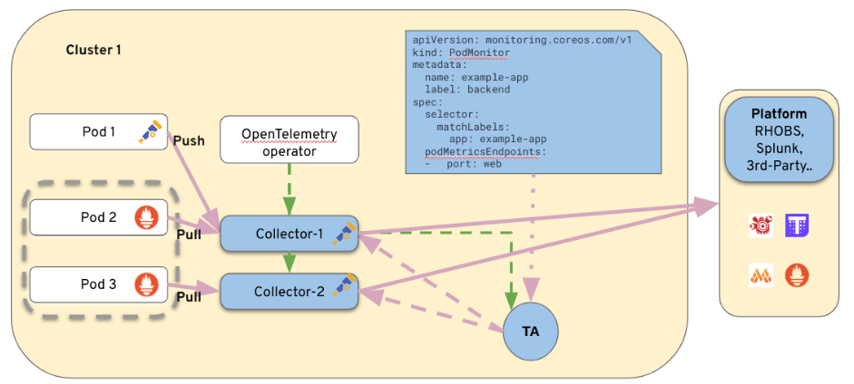
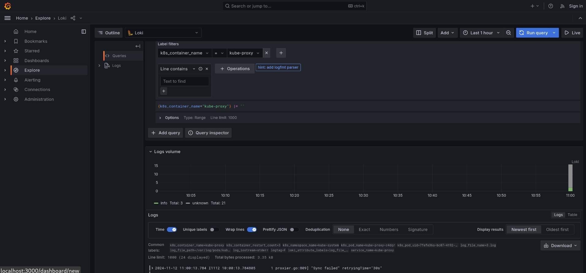
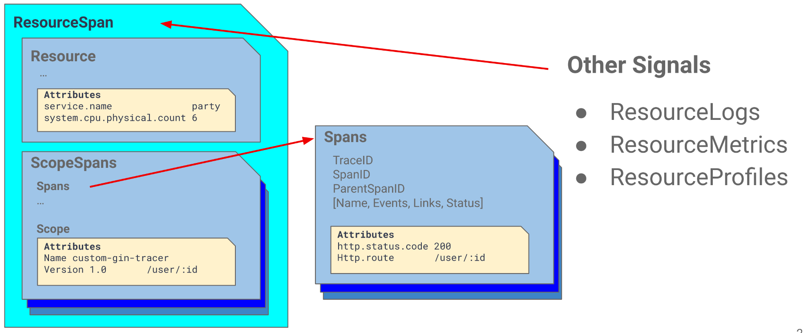
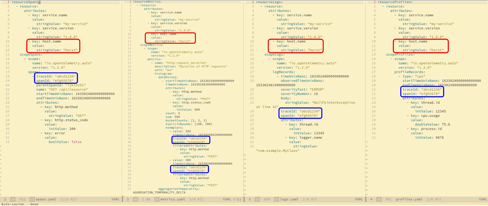

# Datenerfassung mit OpenTelemetry in der Kubernetes/OpenShift Umgebung

## Überblick über das OpenTelemetry-Projekt

### Architektur und Einsatz des OpenTelemetry Collectors

> Herstellerunabhängige Möglichkeit, Telemetriedaten zu empfangen, zu verarbeiten und zu exportieren.



Der OpenTelemetry Collector kann in einige Hauptkomponenten unterteilt werden.

- **Receivers**: Sammeln Daten von einer bestimmten Quelle, z. B. einer Anwendung oder Infrastruktur, und wandeln sie in [pData (Pipeline-Daten)](https://pkg.go.dev/go.opentelemetry.io/collector/consumer/pdata#section-documentation) um. Diese Komponente kann aktiv (z. B. Prometheus) oder passiv (OTLP) sein.
- **Processors**: Verarbeitet die von den Empfängern gesammelten Daten in irgendeiner Weise. Ein Prozessor kann zum Beispiel irrelevante Daten herausfiltern oder Metadaten hinzufügen, um die Analyse zu erleichtern. Wie der Batch- oder Metrik-Umbenennungsprozessor.
- **Exporters**: Senden Daten zur Speicherung oder Analyse an ein externes System. Beispiele sind Prometheus, Loki oder der OTLP-Exporter.
- **Extensions**: Fügen Sie zusätzliche Funktionen zu OpenTelemetry hinzu, wie z. B. die Konfiguration eines Bearer-Tokens oder das Anbieten eines Jaeger-Endpunkts für die Fernabfrage.
- **Connectors**: Ist sowohl ein Exporteur als auch ein Empfänger. Er konsumiert Daten als Exporteur in einer Pipeline und sendet Daten als Empfänger in einer anderen Pipeline.

Weitere Einzelheiten: [offiziellen Dokumentation](https://opentelemetry.io/docs/collector/).

Die verfügbaren Komponenten werden in [Distributionen](https://opentelemetry.io/docs/concepts/distributions/) zusammengefasst. Das OpenTelemetry Projekt stellt derzeit 3 verschiedene Distributionen zur Verfügung.

- Core
- Contrib
- Kubernetes

Mit Hilfe des [OpenTelemetry Collector Builders](https://github.com/open-telemetry/opentelemetry-collector/tree/v0.103.0/cmd/builder) können eigene Distributionen erstellt werden.

### Konfiguration und Deployment des Collectors

Die Konfiguration des OpenTelemetry Collectors wird in YAML beschrieben. Das folgende Beispiel zeigt einen OTLP/gRPC-Receiver, der auf `localhost:4317` lauscht, einen Batch-Prozessor mit den Standardparametern und einen Debug-Exporter mit normalem Log-Level. Zudem werden mehrere Pipelines für verschiedene Telemetriedaten beschrieben, die ihre gesammelten Telemetriedaten alle an den Debug-Exporter weiterleiten.

Um mehr über die Konfigurationsoptionen der einzelnen Komponenten zu erfahren, empfiehlt es sich, das README im jeweiligen Komponentenordner direkt anzusehen, z.B. für den [debugexporter](https://github.com/open-telemetry/opentelemetry-collector/tree/v0.103.0/exporter/debugexporter).

```yaml
---
receivers:
  otlp:
    protocols:
      grpc:
        endpoint: 0.0.0.0:4317
processors:
  batch:

exporters:
  debug:
    verbosity: normal

service:
  pipelines:
    metrics:
      receivers: [otlp]
      processors: [batch]
      exporters: [debug]
    logs:
      receivers: [otlp]
      processors: [batch]
      exporters: [debug]
    traces:
      receivers: [otlp]
      processors: [batch]
      exporters: [debug]
```

#### Collector Lokal ausführen

Hier starten wir einen Collector, der über `localhost` erreichbar ist, mit der oben gezeigten Konfiguration:

```bash
podman run --rm -it --name otel-collector -p 4317:4317 -p 4318:4318 ghcr.io/open-telemetry/opentelemetry-collector-releases/opentelemetry-collector:0.103.0 --config https://raw.githubusercontent.com/frzifus/ContainerConf-Workshop-2024/main/collector-config.yaml
```

#### Telemetriedaten an den Collector senden

Der zuvor konfigurierte Collector lauscht nun auf `localhost:4317` ohne TLS. Um zu testen, ob der Collector tatsächlich Metriken, Logs und Traces empfängt und an den angegebenen Logging-Exporter weiterleitet, können wir mit telemetrygen Testdaten generieren.

```bash
telemetrygen metrics --otlp-insecure --duration 10s --rate 4
# or
telemetrygen logs --otlp-insecure --duration 10s --rate 4
# or
telemetrygen traces --otlp-insecure --duration 10s --rate 4
```

Falls `telemetrygen` nicht installiert ist, kann alternativ auch das Container-Image verwendet werden:

```bash
docker run --rm -it --link otel-collector ghcr.io/open-telemetry/opentelemetry-collector-contrib/telemetrygen:v0.103.0 metrics --otlp-endpoint=otel-collector:4317 --otlp-insecure --duration 10s --rate 4
# or
docker run --rm -it --link otel-collector ghcr.io/open-telemetry/opentelemetry-collector-contrib/telemetrygen:v0.103.0 logs --otlp-endpoint=otel-collector:4317 --otlp-insecure --duration 10s --rate 4
# or
docker run --rm -it --link otel-collector ghcr.io/open-telemetry/opentelemetry-collector-contrib/telemetrygen:v0.103.0 traces --otlp-endpoint=otel-collector:4317 --otlp-insecure --duration 10s --rate 4
```

Erwartete Ausgabe:

```
2024-11-11T12:27:26.638Z	info	LogsExporter	{"kind": "exporter", "data_type": "logs", "name": "logging", "#logs": 1}
2024-11-11T12:27:30.248Z	info	LogsExporter	{"kind": "exporter", "data_type": "logs", "name": "logging", "#logs": 2}
2024-11-11T12:27:34.457Z	info	MetricsExporter	{"kind": "exporter", "data_type": "metrics", "name": "logging", "#metrics": 2}
2024-11-11T12:27:34.857Z	info	MetricsExporter	{"kind": "exporter", "data_type": "metrics", "name": "logging", "#metrics": 1}
2024-11-11T12:27:39.468Z	info	TracesExporter	{"kind": "exporter", "data_type": "traces", "name": "logging", "#spans": 8}
2024-11-11T12:27:41.473Z	info	TracesExporter	{"kind": "exporter", "data_type": "traces", "name": "logging", "#spans": 10}
```

## Datenerfassung in Kubernetes und OpenShift

Für den nächsten Teil benötigen wir das zuvor installierte Observability Backend. Mit kubectl können wir überprüfen, ob der Cluster erreichbar ist und ob das Workshop Backend erfolgreich installiert wurde.
Details zur Installation finden Sie im [Abschnitt Installation](00-prerequisites.md#bereitstellung-der-initialen-services).

```bash
$ kubectl get nodes
NAME                     STATUS   ROLES           AGE     VERSION
workshop-control-plane   Ready    control-plane   3m23s   v1.29.1
$ kubectl get pods -n observability-backend
NAME                             READY   STATUS    RESTARTS      AGE
jaeger-cb9c786c6-pf7pl           1/1     Running   1 (44m ago)   10h
otel-collector-7d6c866bf-r64fl   1/1     Running   1 (44m ago)   10h
prometheus-79d4df4bd9-h94dm      1/1     Running   1 (44m ago)   10h
```

### Einführung des Operators: Konfiguration und Deployment

In `app/install.yaml` finden wir die Demo-Applikation, welche wir auch mit kubectl in einem Namespace unserer Wahl installieren können:

```bash
$ kubectl apply -f https://raw.githubusercontent.com/frzifus/ContainerConf-Workshop-2024/main/app/install.yaml
$ kubectl get pods
NAME                              READY   STATUS    RESTARTS      AGE
postgres-74986b95d7-c7dfz         1/1     Running   2 (51m ago)   8h
py-simple-http-767474bdb9-lsn9p   1/1     Running   1 (51m ago)   8h
py-simple-http-767474bdb9-nnp5z   1/1     Running   1 (51m ago)   8h
python-other-648fb7c7b5-qzjnp     1/1     Running   1 (51m ago)   8h
python-pay-77cff996d8-74scb       1/1     Running   1 (51m ago)   8h
replicator-7979dccfb6-86q2w       1/1     Running   1 (51m ago)   8h
```

Wir können die vollständige Installation überprüfen, indem wir Jaeger und den Replikator lokal mit `kubectl port-foward` zugänglich machen.
```
kubectl port-forward svc/replicator 8080:8080
kubectl port-forward -n observability-backend svc/jaeger-query 16686:16686
```

#### Collector Konfiguration in k8s

Seit der Verfügbarkeit des Collectors in v1beta1 kann die Konfiguration des Collectors in der Custom Resource wie bei anderen Objekten relativ einfach angepasst 

Mit `kubectl edit` lässt sich so, z.B. der [Spanmetrics Connector](https://github.com/open-telemetry/opentelemetry-collector-contrib/blob/main/connector/spanmetricsconnector/README.md) konfigurieren.
Dabei handelt es sich um einen OpenTelemetry Connector, der aus den übertragenen Traces Servicemetriken generiert.

Ziel ist es, das Demo wie folgt anzupassen:



Konfiguration des Span Metric Connectors:
```diff
    processors:
      batch: {}

+    connectors:
+      spanmetrics:
+        namespace: "span.metrics"

    exporters:
      otlp/traces:
        endpoint: jaeger-collector:4317
        tls:
          insecure: true

      otlphttp/metrics:
        endpoint: http://prometheus:80/api/v1/otlp/
        tls:
          insecure: true

      debug:
        verbosity: detailed

    service:
      pipelines:
        traces:
          receivers: [otlp]
          processors: [batch]
-          exporters: [otlp/traces]
+          exporters: [otlp/traces, spanmetrics]
        metrics:
+          receivers: [spanmetrics, otlp, debug]
-          receivers: [otlp]
          processors: [batch]
          exporters: [otlphttp/metrics]
```

Rollout:
```bash
kubectl apply -f https://raw.githubusercontent.com/frzifus/ContainerConf-Workshop-2024/main/backend/02-collector-with-span-metrics.yaml
```

In den Collector Logs sollten wir nun sehen, wie die Metriken aus unseren Traces generiert werden.
```
...
Resource SchemaURL: 
Resource attributes:
     -> service.name: Str(payment)
ScopeMetrics #0
ScopeMetrics SchemaURL: 
InstrumentationScope spanmetricsconnector 
Metric #0
Descriptor:
     -> Name: calls
     -> Description: 
     -> Unit: 
     -> DataType: Sum
     -> IsMonotonic: true
     -> AggregationTemporality: Cumulative
NumberDataPoints #0
Data point attributes:
     -> service.name: Str(payment)
     -> span.name: Str(do-get-handler)
     -> span.kind: Str(SPAN_KIND_INTERNAL)
     -> status.code: Str(STATUS_CODE_UNSET)
StartTimestamp: 2024-11-11 21:26:42.465136337 +0000 UTC
Timestamp: 2024-11-11 21:27:20.807831852 +0000 UTC
Value: 6
...

```

Detailliertere Informationen sind über das Prometheus- oder das Jaeger-Dashboard abrufbar. Prometheus kann mit kubectl port-forward wie folgt verfügbar gemacht werden: `kubectl port-forward -n observability-backend 8081:80`.



Jaeger verwendet die gleiche Schnittstelle, um die Servicemetriken aufbereitet im [Service Performance Monitoring (SPM)](https://www.jaegertracing.io/docs/1.63/spm/) Bereich zur Verfügung zu stellen.


### Integration mit Service- und PodMonitors

Der OpenTelemetry Collector ist in der Lage, Scrape-Targets, die als Service- und Podmonitore spezifiziert wurden, aufzulösen und auf Collector-Instanzen zu verteilen. Dazu werden zunächst die entsprechenden Prometheus CRDs benötigt. Diese können wie folgt installiert werden:

```bash
kubectl apply -f https://raw.githubusercontent.com/prometheus-operator/prometheus-operator/main/example/prometheus-operator-crd/monitoring.coreos.com_servicemonitors.yaml
kubectl apply -f https://raw.githubusercontent.com/prometheus-operator/prometheus-operator/main/example/prometheus-operator-crd/monitoring.coreos.com_podmonitors.yaml
```

Beispiel eines Service-Monitors zur erhebung interner Metriken unseres zuvor ausgerollten OpenTelemetry Collectors:
```yaml
apiVersion: monitoring.coreos.com/v1
kind: ServiceMonitor
metadata:
  name: otel-collector-servicemonitor
  namespace: observability-backend
  labels:
    app: demo
spec:
  selector:
    matchLabels:
      app.kubernetes.io/component: opentelemetry-collector
      app.kubernetes.io/instance: observability-backend.otel
      app.kubernetes.io/name: otel-collector-monitoring
  endpoints:
    - port: monitoring
      targetPort: 8888
      interval: 10s
      path: /metrics
      scheme: http
```

Der Target-Allocator löst ausgewählte Service- und Podmonitore in Scrape-Targets auf und verteilt diese auf einzelne Collector-Instanzen.


Beispiel Konfiguration:
```yaml
apiVersion: opentelemetry.io/v1beta1
kind: OpenTelemetryCollector
metadata:
  name: otel-ta
  namespace: observability-backend
spec:
  managementState: managed
  mode: statefulset
  targetAllocator:
    enabled: true
    serviceAccount: ta # Muss manuell erzeugt werden.
    prometheusCR:
      enabled: true
      serviceMonitorSelector:
        matchLabels:
          app: demo
  config:
    exporters:
      debug: {}
    receivers:
      prometheus:
        config:
          scrape_configs:
          - job_name: 'otel-collector'
            scrape_interval: 30s
            static_configs:
            - targets: [ '0.0.0.0:8888' ]
    service:
      telemetry:
        metrics:
          address: ":8888"
      pipelines:
        metrics:
          receivers: [prometheus]
          exporters: [debug]
```

Rollout:
```bash
kubectl apply -f https://raw.githubusercontent.com/frzifus/ContainerConf-Workshop-2024/main/backend/03-service-monitor.yaml
kubectl apply -f https://raw.githubusercontent.com/frzifus/ContainerConf-Workshop-2024/main/backend/04-collector-ta.yaml
```

Output (`kubectl logs -n observability-backend otel-ta-collector-0`):
```bash
2024-11-11T22:27:57.402Z	info	prometheusreceiver@v0.103.0/metrics_receiver.go:344	Starting scrape manager	{"kind": "receiver", "name": "prometheus", "data_type": "metrics"}
2024-11-11T22:28:43.903Z	info	MetricsExporter	{"kind": "exporter", "data_type": "metrics", "name": "debug", "resource metrics": 1, "metrics": 11, "data points": 11}
2024-11-11T22:29:13.908Z	info	MetricsExporter	{"kind": "exporter", "data_type": "metrics", "name": "debug", "resource metrics": 1, "metrics": 15, "data points": 15}
```

### Logging

```bash
kubectl apply -f https://raw.githubusercontent.com/frzifus/ContainerConf-Workshop-2024/main/backend/04-collector-logging.yaml
```



### Korrelation



