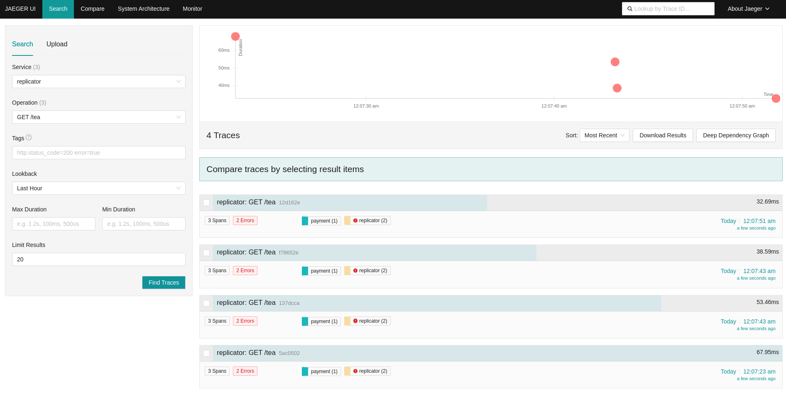
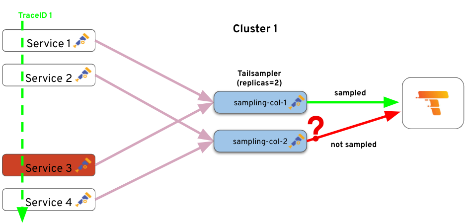
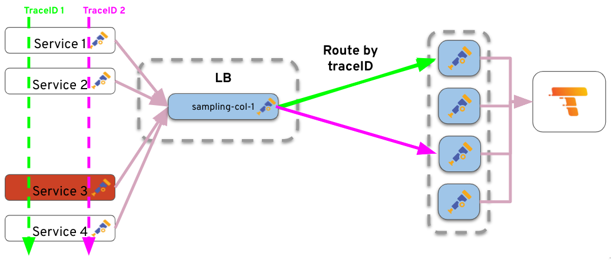
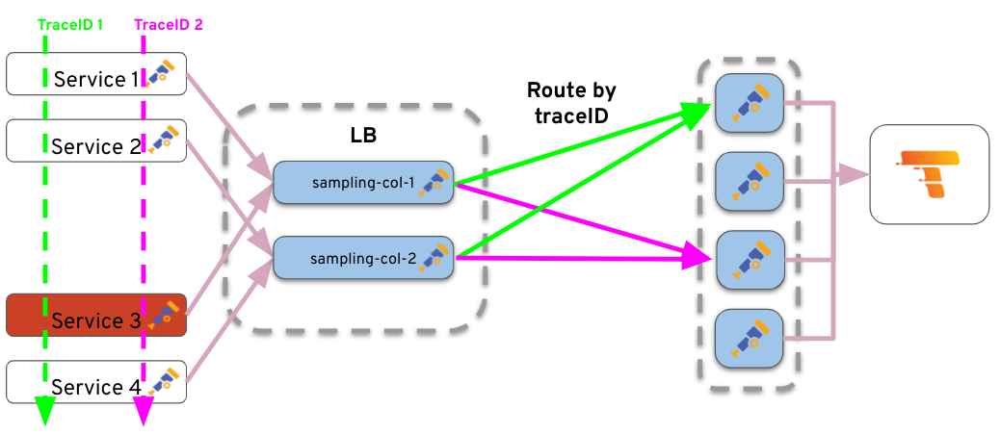

# Sampling und Filtering: Optimierung der Observability in verteilten Systemen

### Theoretische Einführung

!!Siehe slides!!

### Konfiguration Tailbased Sampling

Um die RED Metriken nicht zu verfälschen, erstellen wir eine zweite Trace Pipeline. Der Tailsampling-Prozessor kann direkt in der OpenTelemetry-Konfiguration hinzugefügt werden.

```yaml
    # 1. Sample 100% of traces with ERROR-ing spans
    processors:
      tail_sampling:
        decision_wait: 10s # time to wait before making a sampling decision
        num_traces: 100 # number of traces to be kept in memory
        expected_new_traces_per_sec: 10 # expected rate of new traces per second
        policies:
          - name: keep-errors
            type: status_code
            status_code: {status_codes: [ERROR]}
...
    service:
      pipelines:
+        traces/tailsampling:
+          receivers: [otlp]
+          processors: [tail_sampling, batch]
-          exporters: [otlp/traces, spanmetrics]
+          exporters: [otlp/traces]
        traces:
          receivers: [otlp]
          processors: [batch]
-          exporters: [otlp/traces, spanmetrics]
+          exporters: [spanmetrics]
        metrics:
          receivers: [spanmetrics, otlp]
```

Rollout:
```bash
kubectl apply -f https://raw.githubusercontent.com/frzifus/ContainerConf-Workshop-2024/main/backend/05-collector-tailsampling.yaml
```



### Skalierbarkeit

Problematisch wird es bei mehr als einer Replikation. Der Collector prüft intern, ob ein Trace von einer Policy betroffen ist, was dann nicht mehr funktioniert.

Eine relativ einfache Lösung des Problems ist es, Traces nach ID oder Service Name zu sharden.

Dazu kann ein weiterer Collector als Loadbalancer basierend auf diesen Keys verwendet werden.




